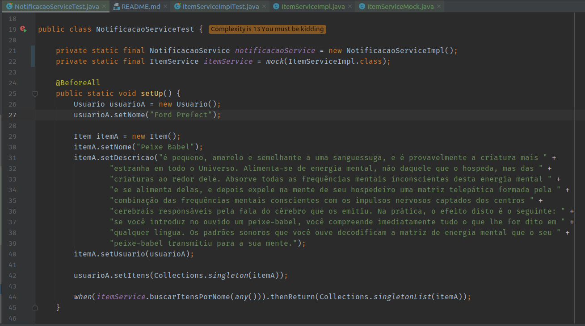
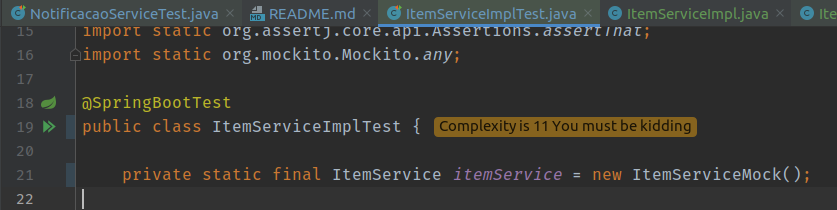

# Escambo
Projeto desenvolvido para aula de Engenharia de Software 2 com o objetivo de desenvolver software usando __TDD__ _(Test Driven Development)_

# Introdução

### Build do Projeto
Na raíz do projeto, faça a build com o comando:
```bash
.\gradlew clean build
```

Use o parâmetro -x para ignorar uma ação do Gradle:
```bash
.\gradlew clean build -x test
```
Este comando é importante no desenvolvimento com TDD, pois no início os testes estarão quebrados, mas isso não significa que o desenvolvimento está errado.

#####Lembre-se de inverter a barra se estiver em ambiente Unix

### Inversão de Controle
Aplicando Injeção de Depêndencia e usando interfaces para representar serviços, foi possível injetar essa interface de maneiras diferentes, possibilitando vários tipos de testes.

##### Usando mocks (ItemService) ou Services Reais (NotificacaoService)


##### Usando Fake Service


### Documentação de Referência
Para referência adicional, considere as seguintes seções:

* [Official Gradle documentation](https://docs.gradle.org)
* [Spring Boot Gradle Plugin Reference Guide](https://docs.spring.io/spring-boot/docs/2.2.6.RELEASE/gradle-plugin/reference/html/)
* [Spring Boot DevTools](https://docs.spring.io/spring-boot/docs/2.2.6.RELEASE/reference/htmlsingle/#using-boot-devtools)
* [Spring Configuration Processor](https://docs.spring.io/spring-boot/docs/2.2.6.RELEASE/reference/htmlsingle/#configuration-metadata-annotation-processor)
* [Spring Data JPA](https://docs.spring.io/spring-boot/docs/2.2.6.RELEASE/reference/htmlsingle/#boot-features-jpa-and-spring-data)

### Guias
Os seguintes guias ilustram como usar alguns recursos concretamente:

* [Building a RESTful Web Service](https://spring.io/guides/gs/rest-service/)
* [Building REST services with Spring](https://spring.io/guides/tutorials/bookmarks/)
* [Accessing Data with JPA](https://spring.io/guides/gs/accessing-data-jpa/)

### Links Adicionais
Essas referências adicionais também devem ajudá-lo:

* [Lombok - Escrevendo menos código](https://medium.com/collabcode/projeto-lombok-escrevendo-menos-c%C3%B3digo-em-java-8fc87b379209)
* [Gradle optimizations](https://medium.com/@wasyl/make-your-gradle-builds-fast-again-ea323ce6a435)
* [Gradle Build Scans – insights for your project's build](https://scans.gradle.com#gradle)